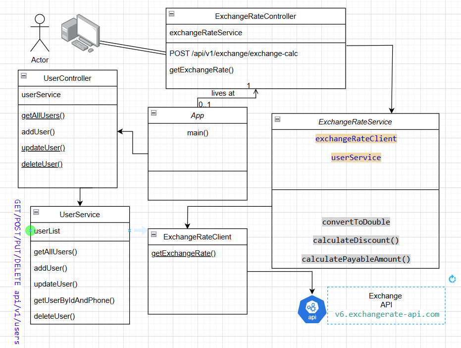

# currency-exchange-and-discount-calculator
API for calculating currency exchange rates and applying discounts.

#1. System Overview
The application provides functionalities to calculate exchange rates based on user input, apply discounts based on user eligibility, and manage user data. It leverages external APIs to fetch currency conversion rates and uses RESTful services for client interactions.

#2. Components

##2.1 Application Structure
**Main Application Class: App** Responsible for bootstrapping the Spring Boot application.

													**Controllers: **
			ExchangeRateController                                            UserController
	Endpoint: /api/v1/exchange/exchange-calc				Endpoint: /api/v1/users
	Method: getExchangeRate(BillDetails billDetails)    	Methods: getAllUsers(), addUser(User user), updateUser(int           																					  id, User user), deleteUser(int id)
	Purpose: Handles incoming requests for exchange 		Purpose: Manages user-related operations.
	rate calculations.
	
 
##2.2 Models
###BillDetails
**Attributes: * id, totalAmount, originalCurrency, targetCurrency, category, phone
###ExchangeRateResponse
**Attributes: * baseCode, targetCode, conversionRate
###User
**Attributes: * id, name, email, phone, employee, affiliate, createdOn, modifiedOn

##2.3 Services
###ExchangeRateService
####Method: 
calculatePayableAmount(BillDetails billDetails)
####Responsibilities:
1. Fetch exchange rates using ExchangeRateClient.
2. Apply discounts based on user information.

###UserService
####Methods:
1. getAllUsers()
2. addUser(User user)
3. updateUser(User user)
4. getUserByIdAndPhone(int id, long phone)
5. deleteUser(int id)

**Responsibilities:**
Manage user data storage and retrieval.

##2.4 Client
###ExchangeRateClient
**Purpose: **Interface for communicating with the external exchange rate API.
####Method: 
1. getExchangeRate(String currency)

##3. Interaction Flow
**Calculating Exchange Rate:**

1. Client sends a POST request to /api/v1/exchange/exchange-calc with BillDetails.
2. ExchangeRateController invokes calculatePayableAmount() from ExchangeRateService.
3. ExchangeRateService retrieves the exchange rate from ExchangeRateClient.
4. It calculates the total amount after applying the eligible discount (if applicable).
5. The calculated amount is returned to the client.

###User Management:

1. Client interacts with /api/v1/users endpoint for various user operations (CRUD).
2. UserController delegates requests to UserService.
3. UserService handles the internal data structure (userList) for user management.

##4. Discount Calculation Logic
**Discounts are applied based on:**

1. User's role (employee, affiliate).
2. User's duration since creation (more than 2 years).
3. A flat discount based on total amount (5 for every 100).
4. Special case for groceries where no discount is applied.

##5. External API Integration
**Exchange Rate API:**
1. The application fetches exchange rates from https://v6.exchangerate-api.com/v6/{API_KEY}/latest.
2. The API key is stored in application.properties.

##6. Data Flow Diagram

##7. Database Design (if needed)
We can replace the below with given project 

##8. Unit Testing
1. Implemented unit tests with coverage more than 90% for services and controllers to ensure functionality is working as expected.
2. Used mocking frameworks like Mockito for dependencies.

##Run Boot
###1. clone project from [GIT](https://github.com/tamitkumar/currency-exchange-and-discount-calculator.git)
###2. configure lombok in IDE
	A. download lombok.jar from [Lombok official website](https://projectlombok.org/download)
	B. open terminal in download location of lombok.jar
	C. run the command "java -jar lombok.jar" from your terminal
	D. Enable Annotation Processing
		1. Open STS.
		2. Go to Window > Preferences.
		3. Navigate to Java > Compiler > Annotation Processing.
		4. Check the box for Enable annotation processing.
		5. Also, under Java > Compiler > Annotation Processing > Factory Path, ensure that the Lombok jar is listed. If it’s not there, you may need to add it manually.
3. build the project from maven clean install
4. run the application mvn spring-boot:run
5. hit http://localhost:8080/swagger-ui/index.html
	

		
		